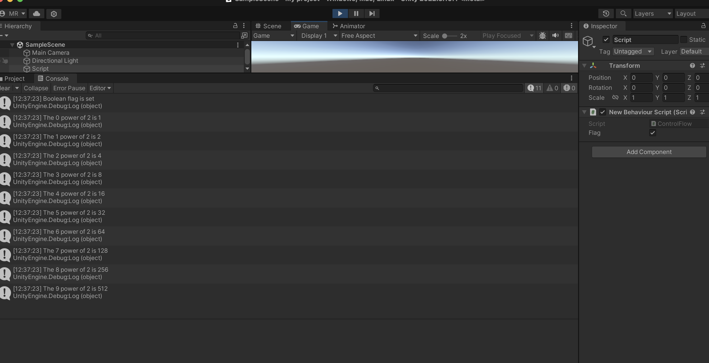
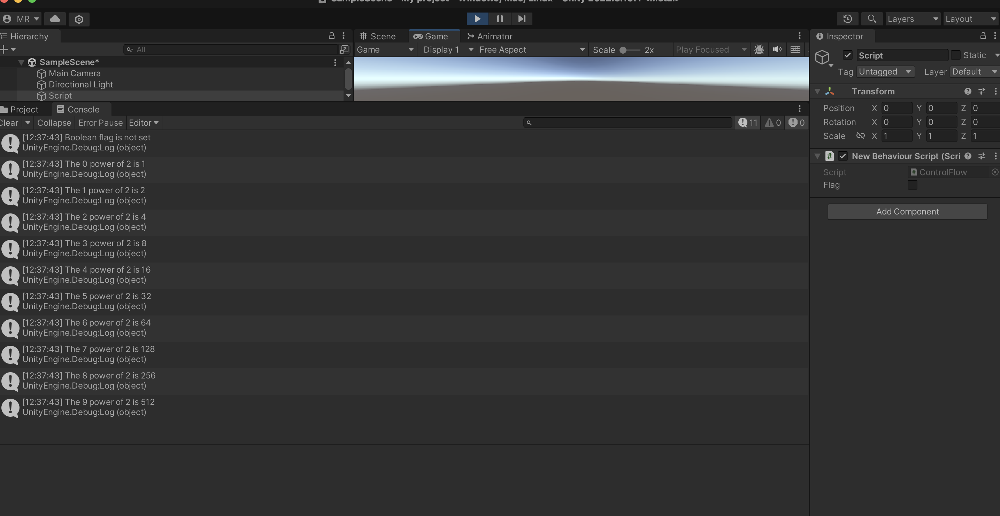

# Homework Week 2
 

 These are the screenshots of the console spitting out if the the flag is active or not, and the powers of 2 

<h>
Screenshot 1. Flag is set
</h>

<h>
Screenshot 2. Flag is not set.
</h>

This is by far my favorite <a href="https://www.youtube.com/watch?v=WKC1Jlx_7ME&list=PLiQ603MjzdMyLjv194emPuqfG-nMaWLxF"> Game OST </a>

